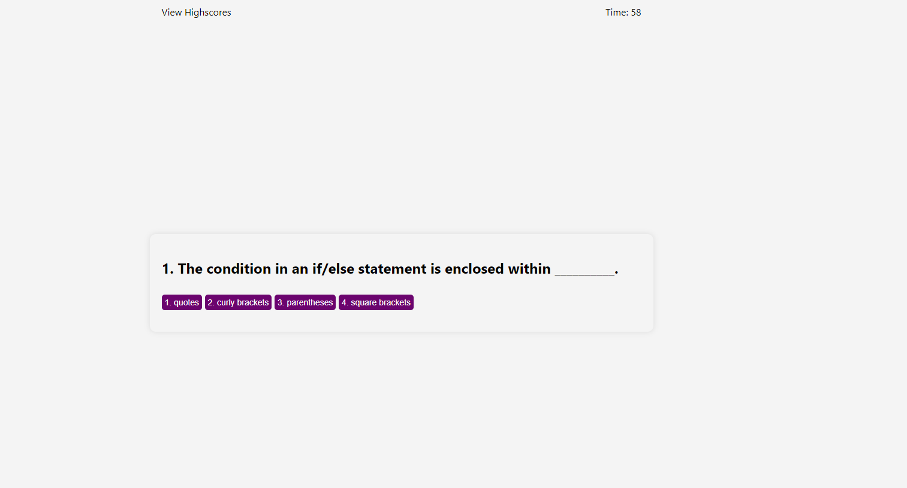

# Code-Quiz

## Description
This project is to build a coding quiz. This project was challenging. The deployed page doesn't quite give all the features I wanted, but I am still learning. I did the best I could with this quiz and I learned a lot about using Web APIs and continuing my learning with JavaScript.

## Link to Deployed Page

## Screenshots of Deployed Webpage

## Local Repo Screenshot

## Credits
I used this README template: 
https://coding-boot-camp.github.io/full-stack/github/professional-readme-guide

I read through these pages and videos to help me with this Challenge:
https://developer.mozilla.org/en-US/docs/Web/API/Document_Object_Model
https://developer.mozilla.org/en-US/docs/Web/API/Window/localStorage
https://developer.mozilla.org/en-US/docs/Web/JavaScript/Guide/Working_with_Objects#defining_methods
https://www.w3schools.com/js/js_htmldom_eventlistener.asp
https://developer.mozilla.org/en-US/docs/Web/API/Event/bubbles

I watched these videos about other password generators:
https://youtu.be/XF1_MlZ5l6M
https://youtu.be/xogpUfUL5kY
https://youtu.be/KaHZdW02Tg0